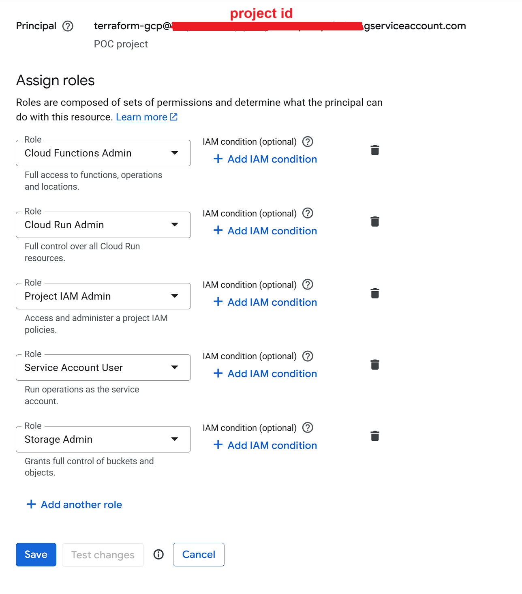

# GCP Terraform Examples

### Resources

- [HashiCorp Terraform provider for Google Cloud](https://registry.terraform.io/providers/hashicorp/google/latest/docs)
- [Udemy Course - Terraform with GCP by Ankit Mistry](https://www.udemy.com/course/terraform-for-beginners-using-google-cloud)

## Examples

| Example | Description |
|---|---|
| `cloud_storage/` | Creates a GCS bucket with a random name and uploads a sample image |
| `cloud_run/` | Deploys a public hello-world container on Cloud Run with a single instance |
| `cloud_function/` | Deploys an HTTP-triggered Cloud Function (Gen 2) that returns the request method and body |

## Authenticate with GCP

### 1. Application Default Credentials (ADC)
Suitable for local development. Creates a local credentials file that tools like Terraform and the gcloud SDK use to authenticate with Google Cloud APIs.

[gcloud auth application-default login](https://docs.cloud.google.com/sdk/gcloud/reference/auth/application-default/login)

### 2. Service Account Keys - preferred in production
Use a Service Account with a JSON key file to authenticate Terraform. More explicit and suitable for CI/CD pipelines and production environments.
- Create a Service Account in the GCP Console.
- Assign appropriate roles (e.g., Editor, Owner, or custom roles).
- Create and download a JSON key file for the Service Account.
- Specify the key file path in the provider configuration (e.g., `credentials = "${path.module}/keys.json"`).

#### Terraform Service Account Roles

The Terraform Service Account needs roles to perform deployment tasks for creating and managing GCP resources:

